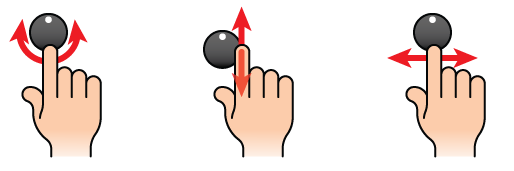

<link href="../demo/asset/ui.css" rel="stylesheet"></link>
<link href="knobs.css" rel="stylesheet"></link>

How Apple Designs a Virtual Knob
================================

When Apple introduced Garageband for the iPad back in March 2011, I knew I just had to try it out. It wasn't just the ability to create music that drew me in, it was the realization that this was a flagship app that uses the strengths of a multitouch interface to create experiences that weren't possible with a keyboard and mouse. My favorite example is how you can hit a note on the sound sampler keyboard then drag your fingers left and right to modulate the pitch. I feel that this strategy of discovering new multitouch interactions is even more clear with the introduction of iPhoto for iOS, even if it [has some problems](http://ignorethecode.net/blog/2012/03/14/mystery_meat_iphoto/).

Some time after a new interface is introduced, a handful of concepts tend to "win" and become a standard way of interacting with the interface. Keyboard shortcuts and right click contextual menus aren't tied to a specific OS, they're part of the standard toolset you get by using a keyboard and mouse. Multitouch is well on its way of defining its own toolset of useful interactions like pinch-to-zoom, swipe, long tap, and many others. With Garageband and iPhoto, Apple is exploring uncharted waters in user interaction and I'm going to talk about one simple control that has a few surprises in both use and implementation: the virtual knob.

Apple's Three Ways to Turn a Virtual Knob
-----------------------------------------

After using the knobs in Garageband for a while, I noticed that they didn't always react the way I thought they would. Most of the time the little indicator dot on the knob would follow my finger as I spun the knob around in a circle. Other times the knob wouldn't follow my finger at all and seemed to go in random directions. I eventually figured out that I had stumbled on three different ways to turn a virtual knob. I was so impressed by this added functionality that I had to try and reproduce it myself, which led to me writing [Knob.js](http://jherrm.github.com/knob), a javascript implementation of multitouch knobs that attempt to replicate the knobs found in Garageband. Knob.js powers all of the examples used in this post.

### Spin
The natural interaction with a knob is to spin, so being able to touch the knob and drag it in a circle is key to a successful virtual knob. If your finger is hiding the indicator you can drag away from the knob so you can see what's going on. Dragging further away from the center of the knob also lets you be more precise in setting the value.

<input id="spin_knob"
       name="spin_knob"
       type="range"
       data-indicator-auto-position="true"
       data-indicator-radius="22"
       data-gesture-slidex-enabled="false"
       data-gesture-slidey-enabled="false"
        />

### Vertical Slide
Just as pinch-to-zoom actually wraps zoom, pan and rotate in one gesture[^1], Apple's knobs also do double duty as sliders. By sliding your finger in a vertical line, the knob will lock into vertical slider mode. This makes it super easy to make the knob spin several full revolutions without giving your finger a workout. Just like a real life physical knob, the direction the knob spins is dependent on which side of the knob you turn. If you start sliding down on the right side of the knob, it will spin clockwise, and if you start sliding down on the left side of the knob it turns counter-clockwise.

<input id="vertical_knob"
       name="vertical_knob"
       type="range"
       data-indicator-auto-position="true"
       data-indicator-radius="22"
       data-gesture-spin-enabled="false"
       data-gesture-slidex-enabled="false"
        />

Another bonus of using the vertical slide gesture with multitouch is you can easily change multiple knobs with one gesture on one hand. Using one finger per knob, drag straight up or down as if they were sliders on a audio mixing board.

### Horizontal Slide
Like the vertical slide, if you start sliding in a horizontal line the knob will lock into horizontal slider mode. Start sliding at the top and moving right causes the knob to spin clockwise, and starting at the bottom and going right will spin the knob counter-clockwise.

<input id="horizontal_knob"
       name="horizontal_knob"
       type="range"
       data-indicator-auto-position="true"
       data-indicator-radius="22"
       data-gesture-spin-enabled="false"
       data-gesture-slidey-enabled="false"
        />

### All Together Now
The demos above restrict the functionality to show each type of interaction one at a time. Try all three together here:

<input id="all_knob"
       name="all_knob"
       type="range"
       data-indicator-auto-position="true"
       data-indicator-radius="22"
        />

How Were They Built?
--------------------
When I set out to replicate the knobs in Garageband, the first thing I did was open up the Garageband.ipa file and extract the assets. What I found was that in order to recreate the classic knobs from various instruments and amps, the developers used several techniques to bring the knobs to life in an efficient and realistic way.

### Knobs with static backgrounds

Non-moving background with a positioned indicator.
<input id="position_knob"
       name="position_knob"
       type="range"
       data-indicator-auto-position="true"
       data-indicator-radius="20"
       data-sprite-width="100"
       data-sprite-height="100"
       data-center-offset-x="2"
       data-center-offset-y="2"
        />

Non-moving background with a rotated indicator.

<input id="rotate_knob"
       name="rotate_knob"
       type="range"
       data-indicator-auto-rotate="true"
       data-angle-slide-ratio="1"
        />

Non-moving background with a positioned and rotated indicator.

### Knobs with repeating backgrounds
Sprite based background images.
Positioned indicator image.

Sprite based background images.
Rotated indicator image.

Sprite based background images.
Positioned and rotated indicator image.

### Fully Rendered 3D Knobs
Some knobs just can't be reproduced with static images or repeating backgrounds. Instead of embedding an OpenGL 3D model of the knob, Apple chose to use a similar solution to the repeating background knobs. They basically created a 3D model of then knob then took a picture of it as they spun it around 3 degrees at a time. Since a circle has 360 degrees that means they're creating 120 different snapshots of the knob! They line them up in order and save it off as a single image that looks like this:

Out of the 25 knobs in Garageband that are able to be turned in all directions, 18 were created using this method. Thanks to <s>Google</s> [Trimble 3D Warehouse](http://sketchup.google.com/3dwarehouse/), I was able to find some 3D knobs and recreate the process using blender and photoshop:

<input id="oven_knob"
       name="oven_knob"
       type="range"
       value="50"
       min="0" max="100"
       data-sprite-count="120"
       data-sprite-width="100"
       data-sprite-height="100"
       data-sprite-direction="cw"
        />

* * *

Thanks to WebGL we can even do one better and use an actual 3D knob!

Garageband Secrets
------------------
While going through the assets extracted from the Garageband, I ended up finding some knobs that didn't make the cut for inclusion in the final release.
 I'm happy to breathe some life into these knobs for the first time outside of Apple labs.

### Test Knob
Before Apple settled on one image for every 3 degrees for 3D knobs, they tested out one image for every 5 degrees - 72 sprites in all. I can only assume they thought the jump from frame to frame was too jarring and was worth the increase in file size.

<input id="test_knob"
       name="test_knob"
       type="range"
       value="50"
       min="0" max="100"
       data-angle-slide-ratio="0.4"
       data-sprite-count="72"
       data-sprite-separation-gap="1"
       data-sprite-separation-angle="5"
       data-sprite-width="91"
       data-sprite-height="91"
        />

### Knob Rejects
There were also three knobs that were fully finished but not included. Two were simple color/material changes to existing knobs, but the round arrow knob is new. I especially enjoy the specular highlights that appear on the rounded part of the arrow as you spin it.

<input id="secret_arrow"
       name="secret_arrow"
       type="range"
       value="50"
       min="0" max="100"
       data-sprite-count="120"
       data-sprite-separation-gap="1"
        />

<input id="secret_red"
       name="secret_red"
       type="range"
       value="50"
       min="0" max="100"
       data-sprite-count="120"
       data-sprite-separation-gap="1"
        />

<input id="secret_metal"
       name="secret_metal"
       type="range"
       value="50"
       min="0" max="100"
       data-sprite-count="120"
       data-sprite-separation-gap="1"
        />

Conclusion
----------
Apple's attention to detail is what has propelled it to be the most valuable company on earth. Whether it's the click of a physical button or the math behind inertial scrolling, Apple employees work really hard to make products that are deceptively simple and just feel right. The virtual knobs found in Garageband are no exception and I hope others enjoyed learning about them as much as I have.

[^1]: Unlike Mobile Safari, in the most popular versions of the browser in Android (as of May 2012), pinch-to-zoom only does zooming. This means that centering the content and zooming in on it require two separate actions - pinch to zoom, then drag to pan. This is the kind of thing that drives iOS natives crazy, yet doesn't seem important enough for Google to fix until version 4 of their OS.

